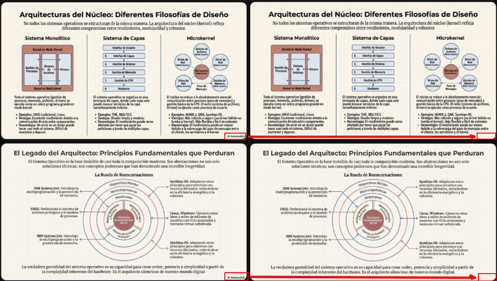

# NotebookLM 水印去除工具



[English](README.md) | [中文](README_zh.md)

一款强大的工具，使用先进 de 计算机视觉技术，可干净地移除 PDF 幻灯片、PowerPoint 演示文稿（PPTX）、图片及信息图（PNG、JPG）中的「NotebookLM」水印。

## 功能说明

**智能去除（图像修复）：**
本工具不采用简单用纯色方块覆盖水印（在渐变或纹理背景上效果很差），而是使用 **基于 AI 的图像修复（计算机视觉）**。
- **检测** 水印：通过分析局部对比度和模糊差异。
- **重建** 水印下方的背景：保留渐变、纹理和幻灯片边框。
- **智能过滤**：智能忽略靠近水印区域 de 幻灯片内容（文字、线条），确保只去除 Logo/文字。

**支持格式：**
- **PDF 文档**：在每一页上无缝去除水印。
- **PPTX 演示文稿**：移除 NotebookLM 导出的 PowerPoint 文件中的水印。
- **图片**：支持 PNG（含透明通道）、JPG、JPEG 和 WEBP。

**特性：**
- 批量处理：一次性清理整个文件夹。
- 进度条：便于跟踪大型任务。
- 预览模式（PDF）：可在第一页上测试效果。
- 智能自动识别文件类型。

## 法律免责声明与合法使用 (Legal Disclaimer & Fair Use)

**免责声明：**
本工具仅限用于您合法拥有或有权修改的文档。对于违反服务条款（ToS）移除归属标识的行为，由用户承担全部责任。作者不认可也不鼓励任何违反服务条款的行为。

**合法使用场景：**
当用户拥有所生成内容的所有权时，移除水印是合法的。例如，Google 表示其 AI 服务生成的内容“Google 不会声称拥有该内容的所有权”。本工具旨在帮助用户清理自己导出的 PDF 和演示文稿，用于个人或专业演示，且用户持有相关的知识产权。

**商业使用条款：**
虽然本软件基于 MIT 许可证提供，但严禁且不鼓励将本工具用于规避第三方服务的付费机制或归属要求的商业用途。

## 快速开始

本仓库基于 Albonire 的原始项目：https://github.com/Albonire/notebooklm-watermark-remover.git。我只是继续开发并补充了下面的全局命令安装与使用方式。

### 安装后可在任意目录使用

如果你希望把这个工具当作全局命令使用，可以直接从 GitHub 安装：

```bash
pip install git+https://github.com/kamachiii/notebooklm-watermark-remover-cmd.git
```

安装完成后，你可以在任意目录的终端或 CMD 中直接执行：

```bash
notebook-remover your-file.pdf
notebook-remover your-file.pptx
notebook-remover your-image.png
```

1. **环境准备：**
```bash
python3 -m venv venv
source venv/bin/activate  # Windows 用户: venv\Scripts\activate
```

2. **安装依赖：**
```bash
pip install -r requirements.txt
```

## 运行 EXE（Windows）

在完成构建（见下方 **构建 EXE**）后，运行：
```bash
dist\NotebookLM-Watermark-Remover.exe presentation.pdf
dist\NotebookLM-Watermark-Remover.exe .\my_folder\
dist\NotebookLM-Watermark-Remover.exe file.pdf -o output.pdf
dist\NotebookLM-Watermark-Remover.exe file.pdf --preview
```

## 使用方法

### 单文件处理（PDF、PPTX 或图片）
```bash
python3 remover.py presentation.pdf
# 或
python3 remover.py presentation.pptx
# 或
python3 remover.py slide.png
```
将在同一目录下生成 `presentation_cleaned.pdf`、`presentation_cleaned.pptx` 或 `slide_cleaned.png`。

### 批量处理文件夹
```bash
python3 remover.py ./my_folder/
```
自动检测并清理目录中所有支持的文件（`.pdf`、`.pptx`、`.png`、`.jpg` 等）。

### 先预览再处理（仅 PDF）
仅对第一页查看效果：
```bash
python3 remover.py file.pdf --preview
```

## 构建 EXE（Windows）

```bash
pip install -r requirements.txt -r requirements-build.txt
python -m PyInstaller remover.spec --noconfirm
```

生成的可执行文件位于 `dist\NotebookLM-Watermark-Remover.exe`。

## 项目结构

- `remover.py` - 核心逻辑，使用 PyMuPDF 和 OpenCV。
- `remover.spec` - 用于构建 Windows exe 的 PyInstaller 配置。
- `requirements.txt` - 依赖：`pymupdf`、`tqdm`、`Pillow`、`opencv-python-headless`、`numpy`。
- `requirements-build.txt` - PyInstaller（仅用于构建 exe）。
- `LICENSE` - MIT 开源协议

## 参与贡献

欢迎提交 Pull Request。如有问题可提 Issue 或通过其他方式联系。
